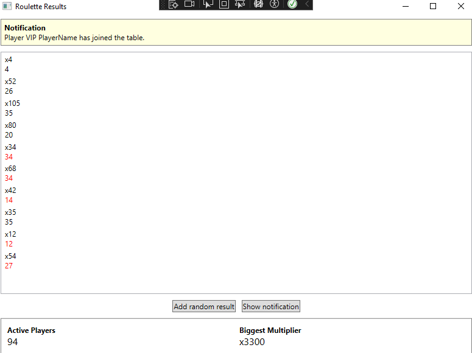

# Roulette Simulator

## Overview
Windows application that simulates a classic red-black roulette game. It provides real-time game statistics, tracks multipliers, and allows networking via a TCP server to handle data.

## Features
- 🎲 **Roulette Simulation**: Spin the wheel and see if you land on red, black, or green!
- 📊 **Live Statistics**: Track the biggest multiplier, active players, and game history.
- 🔗 **TCP Server Integration**: Communicate with clients and process real-time data.
- 🎨 **UI**: Dimple WPF interface for easy navigation.

 <!-- Replace with actual image path -->

## Installation
1. **Clone the Repository:**
2. **Build the Project:**
   - Open `RouletteApp.sln` in Visual Studio.
   - Set the startup project to `RouletteApp`.
   - Build and run the application.

3. **Run the mock TCP Server:**
   - Type cmd in root folder to start console.
   - To start server type:
     ```sh
     python server.py
     ```
   - Ensure port `4948` (or configured port) is open for communication.

## Usage
1. Launch the application.
2. Launch python mock server.
3. Click "Add random result" to play a round of roulette.
4. Click "Show notification" to display hardcoded notification.
5. View results and streak multipliers.

## Testing
This project includes unit tests using `xUnit`.
To run tests:
```sh
cd RouletteApp.Test
 dotnet test
```

## Technologies Used
- **C# & .NET 8**
- **WPF (Windows Presentation Foundation)**
- **TCP Sockets**
- **xUnit for Testing**
- **Newtonsoft.Json for Serialization**

